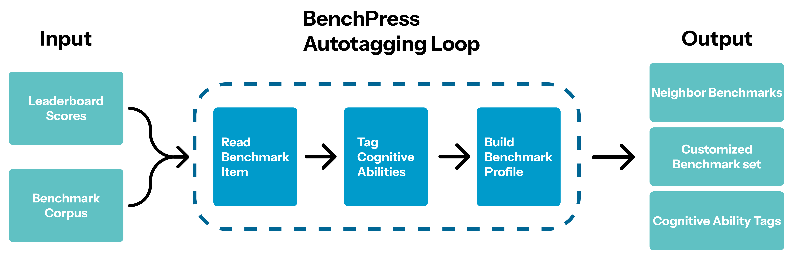

<h1 align="center">BenchPress</h1>

<p align="center">
  <em>Evaluation Planning with Cognitive-Ability Tags Aligned to LLM Benchmark Score Patterns</em>
</p>

<p align="center">
  <b>https://ssu-nlp.github.io/BenchPress/</b>
</p>

<p align="center">
  <a href="https://youtu.be/zF_kGEbVKsI">Demo video</a>
</p>

<p align="center">
  
</p>

## How it works

The system is a closed alignment loop with four LLM roles, driven by a single objective: the
cosine similarity between two benchmarks' ability-tag profiles should track how similarly the
two benchmarks rank models.

- **Mapper** — a lightweight model that tags each benchmark item on every ability axis. It runs
  at high concurrency and produces the raw per-item labels that aggregate into ability profiles.
- **Executer** — regenerates the ability vocabulary each iteration, proposing candidate axis
  sets of varying size.
- **Maker** — reduces per-item evidence into stable per-benchmark profiles via a cached
  map-reduce pass.
- **Improver** — proposes revisions to the tagging prompt and vocabulary. Samples are accepted
  only when they pass an alignment-improvement gate; otherwise the previous state is kept.

The loop optimizes an alignment loss (`L_align`, the error between tag-similarity and
score-ranking-similarity over benchmark pairs) alongside rank-correlation diagnostics
(`ρ_align`) and a tagging-quality term (`Δ_tag`). A candidate survives an iteration only if it
improves these metrics, so the vocabulary is grounded in observed score behavior rather than in
human intuition about categories.

Two stages produce the final artifacts:

- **Pre-experiment (Part 1)** — `autotagging_loop/pretrain.py` runs a single global alignment
  loop and emits the seed taxonomy: `final/I_star.txt` plus `data/cognitive_abilities.json`
  (the seed ability vocabulary).
- **Main experiment (Part 2)** — `autotagging_loop/main.py` (via the runner) reuses those seed
  artifacts and runs the validated loop over held-out splits of benchmarks and models, with
  best-iteration selection tuned for stability and generalization.

## Quickstart

Requires **Python ≥ 3.10** and [uv](https://docs.astral.sh/uv/).

```bash
git clone https://github.com/SSU-NLP/BenchPress.git
cd BenchPress
uv sync
cp .env.example .env    # fill in your API keys
```

The `.env` file configures two provider endpoints: a small model for the Mapper and a larger
model shared by the Executer, Maker, and Improver. Each role in `benchpress_config.json` names
its own `base_url_env` / `api_key_env`, so roles can point at different providers without any
code changes.


## Running the demo locally

The demo has two parts. The Composer is the publishing backend; the Builder is the frontend.

```bash
# Publishing requires Hugging Face credentials (skip if you only want to preview)
hf auth login

# Composer — publishing backend → http://127.0.0.1:7860
uv run python benchpress/space/app.py

# Builder — frontend → http://localhost:5173/BenchPress/
cd benchpress/benchboard && npm install && npm run dev
```

The Composer requires no account, login, or user-provided token to preview compositions.
Publishing does require Hugging Face credentials: `hf auth login` login once before starting
app.py and the Composer will pick up your credentials automatically. 
Generated demo repositories are public and prefixed with `demo-`.
See `benchpress/space/README.md` for the relevant Space secrets and deployment steps.
